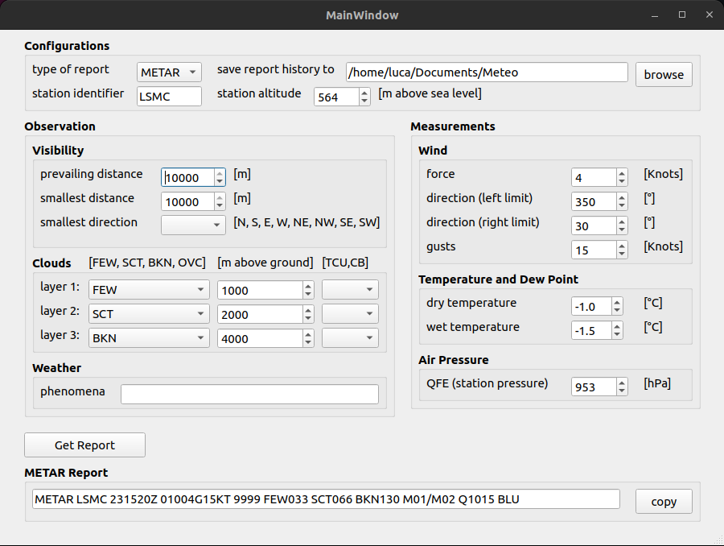

# Meteo

## Preview


## Installation
The program was tested for Python 3.9 on Ubuntu.

### on Ubuntu
#### From Source:
Clone the Meteo repo:
```shell
git clone https://github.com/lucarezzonico/Meteo.git && cd Meteo
```
#### Install Python:
The program was tested for Python 3.9 on Ubuntu.
- For Ubuntu:
```shell
sudo apt install python-pip
sudo add-apt-repository ppa:deadsnakes/ppa
sudo apt-get update
sudo apt-get install python3.9
sudo apt-get install python3.9-dev
```
#### Install Miniconda:
download from [miniconda website](https://conda.io/en/latest/miniconda.html)
#### Create Conda environment:
```shell
conda env create -f environment.yml
```
#### Activate Conda environment:
If you are inside the Conda environment, your shell prompt should look like: (meteo) user@computer:~$
```shell
conda activate meteo
```
#### Install required pip packages
```shell
pip install -r requirements.txt
```
#### Run GUI
To run the application with default parameters simply run:
```shell
python main.py
```

### On Windows
#### download:
download WeatherReport.exe [here](https://github.com/lucarezzonico/Meteo/raw/main/WeatherReport.exe)
#### Run GUI
open and allow WeatherReport.exe


